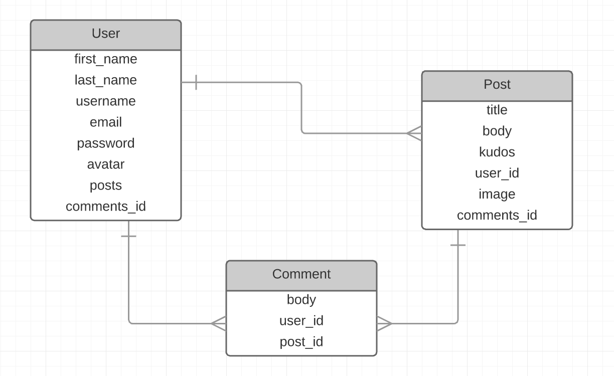

#**WD SM 23 Project 2**
--
#Project #2: **ShoutOut!**
###A Message Board for Positive Reinforcement and Encouragement
--

--
###Overview
--
This webapp was designed with the purpose of creating a community of positive people that lift others up when they accomplish amazing things. 

Since so much of the internet is devoted to tearing people down and arguing, I wanted to create a place that was only used to build people up.

--
###How May I Join?
--

The site is hosted online [here](https://fierce-hollows-46180.herokuapp.com/) through heroku. Create an account with secure login info and an encrypted password. Post a ShoutOut, read someone else's, and comment on theirs to share your support! Image hosting is done through AWS S3, so feel free to upload images to your profile and posts!

--
###Community Rules
--
* Be kind to each other
* Give more than you get

--
###User Stories
--

* As a user, I want to be able to share a ShoutOut about someone that did something awesome
* As a user, I want to be able to view other people's ShoutOuts
* As a user, I want to be able to comment on posts and communicate with other users
* As a user, I want to be able to have a secure account and login

--
###Tech
--

* HTML
* CSS
* Bootstrap
* Javascript
* jQuery
* Ruby on Rails

--
###Resources Used
--

* guides.rubyonrails.org (help with rails)
* getbootstrap.org (help with bootstrap)
* glyphicons.com (ShoutOut bullhorn icon)
* http://www.webtipblog.com/adding-scroll-top-button-website/ (scroll-to-top button)

--
###Custom Gems Used
--

* paperclip for image uploads
* rails_12factor for heroku
* bcrypt for password security
* aws_sdk for S3 hosting
* act_as_votable for likes (not implemented)
* dotenv_rails for environment variables

--
###Future Plans
--

* Clean up unused generated views
* Comment code for better readability
* Comment reply chains for sub-conversations within posts
* Mailers for account creation, verification, and password reset/retrieval
* Password change in user-edit page
* Followers/friends
* Likes/kudos on comments and posts based off of weekly allowances/replenishments
* Subcommunities/private communities for friend groups or companies
* Break up the site into multiple pages
* Realtime updates for editing so the user can preview changes and posts
* Search for posts or users
* Ability to upload multiple images in each post
* Ability to flag or report posts/comments that violate community rules
* View all of a user's posts from their user page
* Increase mobile responsiveness
* Make all usernames and emails unique and non-repeatable
* add notifications for replies and comments

--
###Known Bugs
--

* Mobile view unresponsive, clumsy
* User delete does not work correctly, so there is no button for it

--
###Models
--

